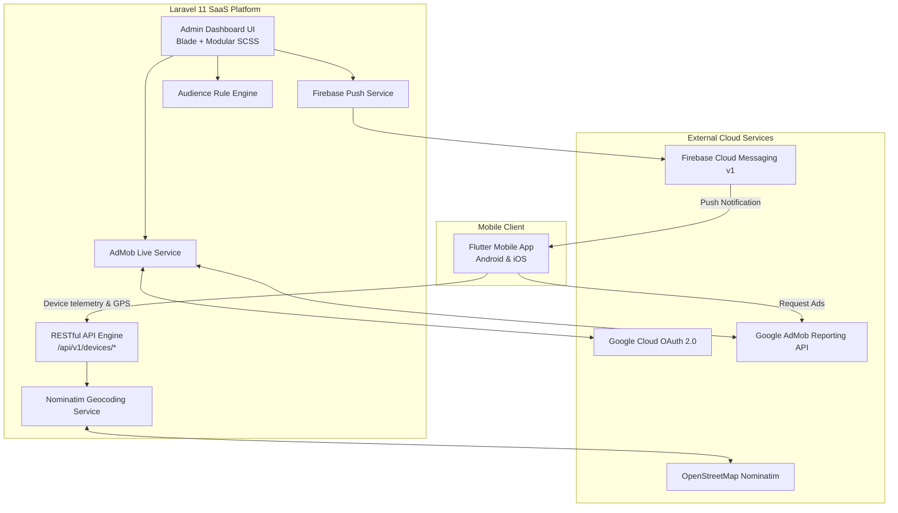

# GeoCam (GPS Camera) — Project Architecture & System Summary

> **Document Purpose:** This document is the single source of truth for the **GeoCam Admin & Backend System**. It is structured so that any developer, AI agent, or architect can immediately understand the architecture, database schema, API contracts, third-party integrations, and workflows without prior context.

---

## 1. Executive Summary

**GeoCam** is a high-performance GPS Camera and location-tagged media application ecosystem consisting of:
1. **Mobile Client (Flutter / Android & iOS):** Captures photos and video stamped with verified real-time GPS metadata, device telemetry, and serves Google AdMob advertisements.
2. **Backend & Admin Panel (Laravel 11 / PHP 8.2+):** A centralized SaaS management platform for device telemetry tracking, geocoding, audience segmentation, Firebase push notifications, RBAC access control, and **live Google AdMob advertising performance analytics**.



---

## 2. Technology Stack

| Layer | Technologies Used | Description / Purpose |
|---|---|---|
| **Backend Framework** | Laravel 11.x, PHP 8.2+ | Modern MVC with Service-Oriented architecture, Eloquent ORM |
| **Database** | MySQL 8.x / MariaDB | Relational storage for devices, locations, segments, campaigns, ads |
| **Frontend Admin UI** | Laravel Blade, Vanilla SCSS, Bootstrap 5.3 | Custom high-contrast dashboard, glassmorphism, responsive data tables |
| **Frontend Styling** | Modular SCSS (`resources/sass/`) | Design token system, zero Tailwind dependency, custom CSS components |
| **Interactivity & UI** | Vanilla JS, SweetAlert2, FontAwesome 6 | Async AJAX controls, modals, toast popups, metric badges |
| **Asset Bundler** | Vite 5.x | High-speed hot module replacement & SCSS compilation |
| **Push Notifications** | Google Firebase Admin SDK (FCM HTTP v1) | Multi-project service account JSON storage & notification delivery |
| **Monetization** | Google AdMob Reporting API v1, Google OAuth 2.0 | Automated publisher token refresh, real-time revenue & impression stats |
| **Geocoding** | OpenStreetMap Nominatim API | Automated reverse-geocoding of device coordinates into City/State/Country |

---

## 3. Project Directory Structure

```text
GeoCam/
├── app/
│   ├── Http/
│   │   └── Controllers/
│   │       ├── Admin/                       # Admin Web Panel Controllers
│   │       │   ├── AdManagementController.php      # Live AdMob dashboard & OAuth actions
│   │       │   ├── AudienceSegmentController.php   # Dynamic user segmentation
│   │       │   ├── AuthController.php              # Multi-admin session & login
│   │       │   ├── DeviceController.php            # Installed devices telemetry management
│   │       │   ├── FirebaseSettingController.php   # FCM service account management
│   │       │   ├── LocationController.php          # Geographic intelligence & maps
│   │       │   ├── NotificationController.php      # Push notification campaigns
│   │       │   ├── ProfileController.php           # Admin password & profile settings
│   │       │   ├── RoleController.php              # RBAC Roles & Permissions
│   │       │   └── UserController.php              # Admin staff user management
│   │       └── Api/                         # Mobile Client REST API Controllers
│   │           └── DeviceApiController.php         # POST /api/v1/devices/register & sync
│   ├── Models/                              # Eloquent Models
│   │   ├── AdMobSetting.php                 # AdMob OAuth tokens, publisher ID, app IDs
│   │   ├── AudienceSegment.php              # Saved segment queries & rules
│   │   ├── Device.php                       # Registered mobile device telemetry
│   │   ├── FirebaseSetting.php              # Firebase multi-project credentials
│   │   ├── Location.php                     # Normalized city/state/country directory
│   │   ├── NotificationCampaign.php         # Campaign delivery logs & stats
│   │   ├── Permission.php & Role.php        # Granular RBAC tables
│   │   ├── SegmentDevice.php                # Pivot table linking devices to segments
│   │   └── User.php                         # Admin users
│   └── Services/                            # Core Business Logic Layer
│       ├── AdMobService.php                 # Live AdMob API reporting & OAuth handling
│       ├── AudienceRuleEngine.php           # Evaluates JSON filter rules on devices
│       ├── AudienceSegmentService.php       # Segment generation & device grouping
│       ├── DeviceService.php                # Device registration & coordinate processing
│       ├── FirebaseSettingService.php       # Validates & activates Firebase JSON keys
│       ├── LocationService.php              # Geocoding & coordinate density calculations
│       └── NotificationService.php          # Dispatches push notifications via FCM v1
├── database/
│   └── migrations/                          # 12 Database Schema Migrations
├── resources/
│   ├── sass/                                # Modular SCSS Theme System
│   │   ├── _variables.scss, _mixins.scss, _base.scss
│   │   ├── _sidebar.scss, _navbar.scss, _dashboard.scss, _ads.scss
│   │   └── app.scss                         # Entrypoint bundled via Vite
│   └── views/                               # Blade Templates
│       ├── admin/
│       │   ├── ads/                         # index.blade.php (Live Ads), configuration.blade.php
│       │   ├── auth/                        # login.blade.php, forgot-password.blade.php
│       │   ├── devices/, locations/, notifications/, roles/, segments/, users/
│       │   └── dashboard.blade.php          # Master dashboard overview
│       └── layout.blade.php                 # App master template with global toasts
└── routes/
    ├── admin.php                            # Protected /admin/* routes
    ├── api.php                              # Public /api/v1/* mobile routes
    └── web.php                              # Root redirects & web bindings
```

---

## 4. Database Schema & Key Models

### 1. `admob_settings` (Singleton Configuration)
Stores Google OAuth 2.0 tokens, publisher credentials, and mobile application package registrations.
* **Fields:**
  * `publisher_id`: Verified 16-digit publisher ID (`ca-pub-XXXXXXXXXXXXXXXX` or `pub-XXXXXXXXXXXXXXXX`).
  * `google_client_id` & `google_client_secret`: Google Cloud OAuth credentials.
  * `access_token` & `refresh_token`: OAuth 2.0 bearer and offline refresh tokens.
  * `token_expires_at`: Expiration timestamp with automated background token refreshing.
  * `is_connected`: Boolean flag indicating verified Google OAuth & AdMob account linkage.
  * `connected_email`: Google account email used to authenticate AdMob.
  * `android_app_id` & `ios_app_id`: AdMob App IDs (e.g. `ca-app-pub-XXXXXXXXXXXXXXXX~XXXXXXXXXX`).
  * `android_package_name` & `ios_bundle_id`: Mobile bundle identifiers.
  * `enable_test_ads` & `test_device_ids`: Whitelist of QA advertising IDs to prevent click fraud.
  * `last_synced_at` & `last_sync_message`: API sync telemetry.

### 2. `devices` (Mobile Device Telemetry)
Maintains persistent hardware state and location coordinates sent by the Flutter app.
* **Fields:**
  * `app_installation_id`: Unique client UUID persistent across app updates.
  * `device_model`, `manufacturer`, `os_type` (`Android` / `iOS`), `os_version`.
  * `app_version`, `app_build_number`.
  * `latitude` & `longitude`: Accurate GPS sensor readings from phone.
  * `city`, `state`, `country`, `country_code`: Reverse-geocoded location data.
  * `fcm_token`: Device Firebase Messaging registration token.
  * `battery_level`, `is_charging`, `network_type` (`Wi-Fi`, `5G`, `4G`).
  * `status`: `active`, `inactive`, `uninstalled`.
  * `last_active_at`: Heartbeat timestamp.

### 3. `locations` (Geographic Intelligence)
Aggregated geographic entities enabling regional analytics and geofenced campaign targeting.
* **Fields:** `city`, `state`, `country`, `country_code`, `total_devices`, `active_devices`, `latitude`, `longitude`.

### 4. `audience_segments` & `segment_devices`
Custom user groups defined by JSON filter criteria (e.g., *Active in India on Android 14+*).
* **Fields:** `name`, `criteria` (JSON filter rules), `total_devices`, `is_active`.

### 5. `notification_campaigns`
History and scheduling of push notifications sent to devices or audience segments.
* **Fields:** `title`, `body`, `image_url`, `target_type` (`all`, `segment`, `location`, `single_device`), `status` (`draft`, `scheduled`, `sending`, `sent`, `failed`), `sent_count`, `delivered_count`, `opened_count`.

### 6. `roles`, `permissions`, & `role_permission`
Granular Role-Based Access Control (RBAC) protecting admin actions. Default roles include `Super Admin`, `Admin`, `Editor`, and `Viewer`.

---

## 5. Core System Modules

### A. Ad Management & Google AdMob Live Integration
* **Route:** `/admin/ad-management` and `/admin/ad-management/configuration`
* **Real-time API Reporting:** Connects directly to Google's official AdMob API endpoint:
  `POST https://admob.googleapis.com/v1/{accounts/pub-XXXXXXXXXXXXXXXX}/networkReport:generate`
* **Live Stats Cards:**
  * **Revenue:** Calculated live from `microsValue` returned by Google AdMob.
  * **Impressions & Clicks:** Live totals from AdMob Network Reports.
  * **Fill Rate & CTR:** Real-time percentage conversions calculated across reporting periods.
  * **Active Ads:** Dynamically pulls verified ad units directly via `GET https://admob.googleapis.com/v1/{account}/adUnits`.
* **OAuth 2.0 Security:**
  * Uses Google OAuth 2.0 with offline access.
  * Checks `accounts.list` on callback to ensure the authenticated Google identity actually owns an active AdMob publisher account.
  * Automatically refreshes expired OAuth tokens before making reporting calls.

### B. Mobile Device Telemetry & Registration API
* **Route:** `POST /api/v1/devices/register` (also `/api/v1/devices/sync`)
* **Purpose:** Mobile client calls this on launch.
* **Coordinates & Geocoding:** When Flutter passes `latitude` and `longitude`, the backend asynchronously reverse-geocodes them into `city`, `state`, and `country` using OpenStreetMap Nominatim and caches the location.

### C. Audience Segmentation & Rule Engine
* Evaluates dynamic rules on registered devices (e.g. `country == 'IN' AND os_type == 'Android' AND battery_level < 20`).
* Provides live estimation of audience size before campaigns are dispatched.

### D. Push Notifications (Firebase FCM HTTP v1)
* Dispatches targeted and broadcast push notifications to registered `fcm_token`s.
* Supports uploading private service account JSON keys directly through the Admin UI.

---

## 6. Mobile (Flutter) API Contract

### **Endpoint:** `POST /api/v1/devices/register`
Call this on mobile app launch.

#### **Request Body:**
```json
{
  "app_installation_id": "INS-A1B2C3D4",
  "device_name": "Samsung Galaxy S24",
  "device_model": "SM-S928B",
  "manufacturer": "Samsung",
  "os_type": "Android",
  "os_version": "14",
  "app_version": "1.0.0",
  "app_build_number": 1,
  "fcm_token": "fJ3...long_token",
  "latitude": 28.6139,
  "longitude": 77.2090,
  "battery_level": 88,
  "is_charging": false,
  "network_type": "Wi-Fi",
  "language": "en"
}
```

#### **Success Response (200 OK):**
```json
{
  "success": true,
  "message": "Device registered successfully",
  "data": {
    "device_id": 12,
    "app_installation_id": "INS-A1B2C3D4",
    "location": "New Delhi, Delhi, India",
    "status": "active"
  }
}
```

---

## 7. Google Cloud & AdMob Configuration Guide

For Google OAuth 2.0 and AdMob integration to function correctly:

1. **Google Cloud Console -> Google Auth Platform:**
   * **Application Type:** Web Application
   * **Authorised JavaScript Origins:**
     * `http://localhost:8000`
     * `http://127.0.0.1:8000`
   * **Authorised Redirect URIs:**
     * `http://localhost:8000/admin/ad-management/oauth/callback`
     * `http://127.0.0.1:8000/admin/ad-management/oauth/callback`
   * **Audience (Publishing Status: Testing):**
     * Add developer's Google email (e.g. `adullahash@gmail.com`) under **Test users**.
   * **APIs & Services:**
     * Enable the **Google Mobile Ads (AdMob) API**.

2. **Environment Variables (`.env`):**
   ```env
   GOOGLE_CLIENT_ID=YOUR_GOOGLE_CLIENT_ID.apps.googleusercontent.com
   GOOGLE_CLIENT_SECRET=GOCSPX-YOUR_CLIENT_SECRET
   ```

---

## 8. Local Development & Operational Commands

```bash
# 1. Install Dependencies
composer install
npm install

# 2. Run Database Migrations
php artisan migrate

# 3. Start Local Development Server
php artisan serve
npm run dev

# 4. Clear Application & View Caches
php artisan view:clear
php artisan config:clear
php artisan cache:clear
```

---

## 9. Current Status & Next Steps

* **Admin UI & Dashboard:** 100% completed with responsive Blade views and modular SCSS.
* **AdMob Live Reporting:** 100% connected to Google API. Shows real-time metrics and live ad units (detected: `"Banner gps"`).
* **Next Steps for Flutter Team:**
  1. Integrate the Google Mobile Ads SDK using the detected App ID (`ca-app-pub-4226750093818277~4456983233`) and Banner Ad Unit ID (`ca-app-pub-4226750093818277/8813312017`).
  2. Implement the `DeviceRegistrationService` in Flutter following [`FLUTTER_API_INTEGRATION_GUIDE.md`](file:///c:/Users/raiya/Desktop/GeoCam/FLUTTER_API_INTEGRATION_GUIDE.md).
  3. Once the mobile app serves live impressions on physical devices, revenue and impressions will automatically populate on `/admin/ad-management`.
